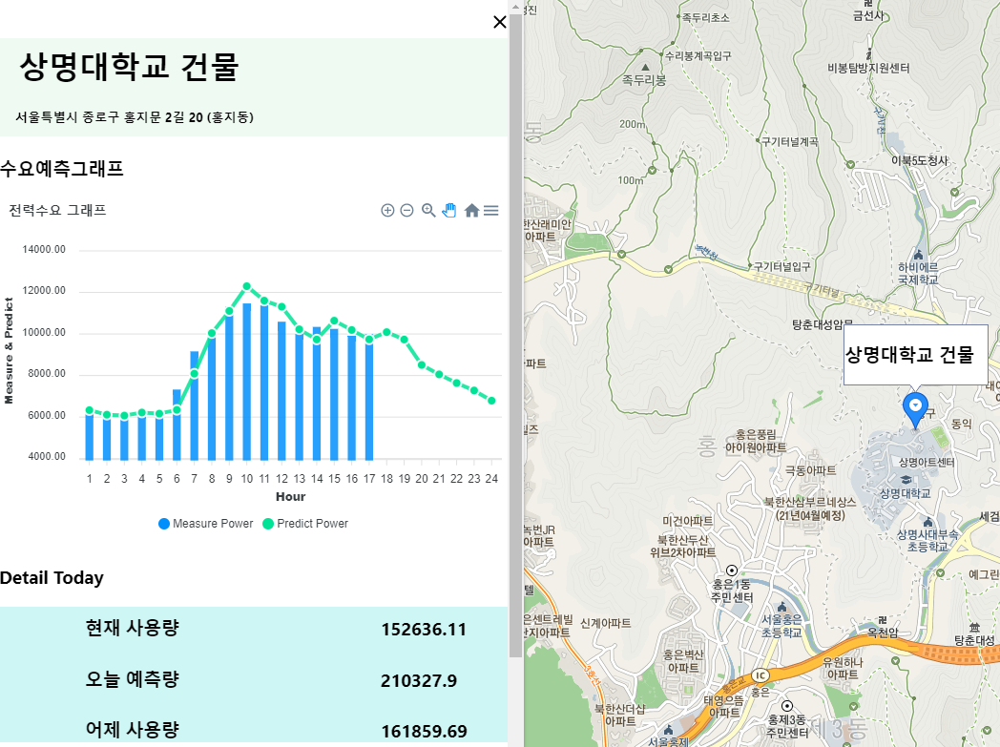

# power_monitoring_system
React 기반 전력수요 예측 모니터링 웹 시스템 개발

기간 : 2020.09 ~ 2021.01 (4개월)

스택

* Tensorflow
* Tensorflow Serving
* Docker, Docker-Compose
* Flask
* React
* MariaDB

결과

System Architecture

Result Page

